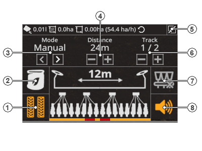

# ProSeed for Farming Simulator 22
 [](https://github.com/stijnwop/proSeed/releases)

###### Readme in English can be found [here](README.md).

ProSeed erweitert Sämaschinen mit neuen Funktionen um sie weiter zu verbessern.
Mit ProSeed kannst du Fahrgassen erstellen (optional mit Vorauflaufmarkierung), Sämaschinen halbseitig abschalten um perfekte Fahrgassen erstellen zu können. Die Unterfußdüngung kann optional deaktiviert werden und es gibt dir Rückmeldung durch akustische Signale.

## Veröffentlichen
Nur Wopster darf jeglichen Code als Mod auf anderen Modseiten oder Dateihostern veröffentlichen. Der Code ist offen für die eigene Nutzung, benenne Mich in den Credits. Ich gebe keine Unterstützung von irgendeiner 'Version' von ProSeed, die von einer dubiosen Modseite kommt. Versionen werden von Mir bestimmt und nicht von irgendeiner anderen Seite. Dies verwirrt nur und hindert die Entwicklung, was mir keinen Spaß macht!

## Danksagung
Besonderen Dank an gotchTOM und webalizer für die Freigabe einer Neuauflage für LS19/LS22!

## Warnung!
Bedenke, dies ist eine ***ENTWICKLER VERSION***!
* Die Entwickler Version kann dein Spiel oder Spielstand beschädigen!
* Die Entwickler Version unterstützt nicht den vollen Funktionsumfang!

#### Mehrspieler
Diese Version sollte im Mehrspieler funktionieren.

# Installation / Veröffentlichungen
Aktuell ist die Entwickler Version nur über GitHub verfügbar. Sobald eine offizelle Version verfügbar ist, findest du diese in der [release section](https://github.com/stijnwop/proSeed/releases).

> _Bitte beachte: falls keine offizielle Version verfügbar ist, bedeutet dies: es gibt keine._

Alle offiziellen Veröffentlichungen werden im offizeillen ModHub verfügbar sein.

Zur Installation:

Windows: Kopiere die `FS22_proSeed.zip` in dein `My Games\FarmingSimulator2022\mods` Verzeichnis.

## Dokumentation

### Übersicht
Sobald eine Sämaschine angekuppelt ist, wird folgenes HUD angezeigt.


In der unteren Tabelle findest du eine Tastenübersicht.

| Nummer | Beschreibung |
| ------------- | ------------------ |
| 1 | Vorauflaufmakierer umschalten (dies schaltet NUR die Sichtbarkeit der Fahrgasse und NICHT die Erstellung der Gasse um!) |
| 2 | Unterfußdüngung ein/ausschalten |
| 3 | Fahrgassenmodus durchschalten (Manuell, Semi und Auto) |
| 4 | Ändern des Fahrgassenabstands (zum Anpassen an nachfolgende Maschinen, zB Spritzen oder Streuer) |
| 5 | Minimieren und Maximieren des HUD |
| 6 | Spur wechseln (nur im Semi Modus) |
| 7 | halbseitige Abschaltung ein/ausschalten |
| 8 | akustische Signale ein/ausschalten |

> **HINWEIS: Einige Funktionen / Tasten sind nur in bestimmten Modi verfügbar, in grau sind sie deaktiviert.**

Darüber hinaus gibt es einige Anzeigen die dich durch den Säprozess begleiten. Im oberen Balken werden Saatgutverbrauch und Hektarzähler angezeigt. Um diese zurückzusetzen, drücke die Reset taste.
In der Mitte des HUD wird die Arbeitsbreite der Sämaschine und der Status der Spurreißer angezeigt. Der große orangene Balken unten zeigt an, ob Fahrgassen aktiv oder Segmente abgeschaltet sind.
Das HUD kann frei palziert werden und die Position wird gespeichert.

### Nutzung

#### Modi
In der folgenen Tabelle werden die möglichen Modi erläutert. Sie können die Modi umschalten, indem sie die Pfeile (Bild 3) benutzen.

| Modus | Beschreibung | unterstützt Helfer |
| ------------- | ------------------ | ------------------ |
| Manuell | Im `Manuell` Modus kann der Spieler frei entscheiden ob er Fahrgassen erstellt oder nicht, indem er die Tasten `KEY_lstrg + KEY_r` drückt. Die Option Fahrgassenabstände einzustellen ist hier deaktivert. | nein
| Semi | Im `Semi` Modus muss der Spieler den Fahrgassen einstellen indem er die Pfeile (Bild 4) benutzt (Abstände entsprechen einer Arbeitsbreite). Die Spuren werden beim Absenken automatisch weiter gezählt, über das HUD kannst du diese mit den Pfeile korrigieren. Fahrgassen werden automatisch erstellt. | ja
| Auto | Im `Auto` Modus muss der Spieler mit den Pfeilen (Bild 4) nur den Fahrgassenabstand einstellen (Abstände entsprechen einer Arbeitsbreite). Korrigiert bei Bedarf die Arbeitsbreite im GPS und die Spuren werden automatisch vom GuidanceSteering Mod weitergezählt. Fahrgassen werden automatisch erstellt. | nein

> **HINWEIS: Um den `Auto` Modus zu benutzen ist [GuidanceSteering](https://www.farming-simulator.com/mod.php?mod_id=140328&title=fs2019) notwendig!**

#### Wie man beginnt
Ist die Gesamtanzahl der Spuren gerade, starte immer mit einer halben Spur. Ansonsten passt der Abstand zum Feldrand nicht.
Beispiel: im HUD Bild oben ist die Gesamtzahl 2 `x / 2` hier sollte man also mit einer halben Spur beginnen.
Benutze die halbseitge Abschaltung um die erste Spur zu erstellen.

Bei Nutzung von GuidanceSteering muss die erste Spur (0) am Feldrand sein (`ALT + HOME`).
Für die zweite Spur verschiebe die GS Spur um die halbe Arbeitsbreite Richtung Feldrand.

Eine Beschreibung von möglichen Arbeitsbreiten und Abständen findest du in diesen PDF Dokumenten: [proSeed.pdf](https://github.com/stijnwop/proSeed/raw/master/docs/ProSeed.pdf) (Page 1: Deutsch; Page 2: Englisch)

#### Using tramline animation
You can trigger an animation once the tramlines are active like so:

```xml
<vehicle>
    <proSeed>
       <tramLinesAnimation name="tramLines" speed="1"/>
    </proSeed>

    <animations>
       <animation name="tramLines">
          <part node="NODE_NAME" startTime="0" endTime="1" startTrans="0 1 0" endTrans="0 0 0" />
       </animation>
    </animations>
</vehicle>
```

## Copyright
Copyright (c) 2022 [Wopster](https://github.com/stijnwop).
Alle Rechte vorbehalten.
